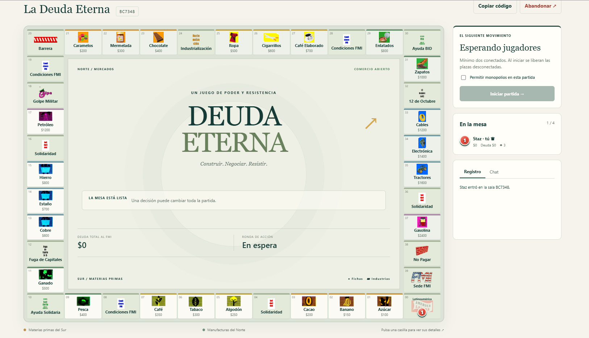

# La Deuda Eterna · Edición web y multiplataforma



Juego de mesa multijugador de estrategia económica: desarrolla materias primas en el Sur, construye manufacturas en el Norte, negocia con otros jugadores y gestiona tu deuda con el FMI.

**[Jugar en línea](https://la-deuda-eterna.onrender.com/) · [Repositorio](https://github.com/Stazkun99/la-deuda-eterna) · [Historial de cambios](CAMBIOS.md)**

Esta adaptación admite **2–4 jugadores** y funciona en navegadores de escritorio y móvil. Las salas se comparten por código; no hace falta crear una cuenta. El servidor decide los resultados y valida cada acción.

## Contenido

- [Funciones](#funciones)
- [Instalación local](#instalación-local)
- [Cómo jugar](#cómo-jugar)
- [Comercio entre jugadores](#comercio-entre-jugadores)
- [Reglas de esta edición](#reglas-de-esta-edición)
- [Guardado y reconexión](#guardado-y-reconexión)
- [Configuración](#configuración)
- [Despliegue en Render](#despliegue-en-render)
- [Actualizar GitHub](#actualizar-github)
- [Aplicaciones Android y Windows](#aplicaciones-android-y-windows)
- [Desarrollo y pruebas](#desarrollo-y-pruebas)
- [Ilustraciones originales](#ilustraciones-originales)
- [Solución de problemas](#solución-de-problemas)
- [Alcance y próximos pasos](#alcance-y-próximos-pasos)

## Funciones

- Tablero HTML de 40 casillas. Las fichas e industrias pertenecen a cada casilla: el movimiento no depende de coordenadas sobre una imagen.
- Fichas numeradas con relieve, colores de jugador y aro dorado para el turno activo; agrupación cuando coinciden varias.
- Dados animados con resultado confirmado por el servidor y adaptación a la preferencia de movimiento reducido.
- Doce materias primas del Sur y doce manufacturas del Norte, cada una con su ilustración correspondiente.
- Imágenes originales de propiedades, casillas especiales, 20 cartas de Solidaridad y 17 condiciones FMI.
- Cartas completas al sacarlas y opción de volver a consultar la última carta.
- Compra, construcción, rentas, préstamos, amortización, oro, alianzas, subastas y monopolio opcional.
- Industrialización con elección de terreno libre o mejora gratuita cuando todos están ocupados.
- Comercio consensuado de propiedades y dinero entre jugadores o grupos.
- Chat de sala, registro de acciones, temporizador y recuperación de sesión.
- Guardado en JSON y pruebas automáticas de reglas, conexiones, recursos y persistencia.

## Instalación local

Necesitas **Node.js 22 o posterior**, npm y Git para clonar el repositorio. No hay una compilación del frontend ni se necesita una base de datos para arrancar.

```sh
git clone https://github.com/Stazkun99/la-deuda-eterna.git
cd la-deuda-eterna
npm ci
npm start
```

Abre [localhost:3001](http://localhost:3001). Para detener el servidor, pulsa `Ctrl+C` en su consola.

Para probar tú solo una sala multijugador, usa una ventana normal y otra de incógnito, o perfiles de navegador distintos. Dos pestañas del mismo perfil comparten identidad: la conexión más reciente sustituye a la anterior.

## Cómo jugar

1. Escribe tu nombre y crea una sala.
2. Comparte el código con tus amigos; entran desde la misma web y eligen **Unirme a la sala**.
3. El anfitrión inicia cuando haya al menos dos jugadores conectados. Puede activar los monopolios antes de empezar.
Cada jugador recibe **$5.000 + un dado × $200** (entre $5.200 y $6.200), con deuda inicial cero. La tirada más alta decide quién empieza. Si hay empate en el valor más alto, se sortea el primer turno únicamente entre esos jugadores, sin prioridad para el anfitrión. Después se sigue el orden de la mesa. Los resultados quedan visibles en «Dados y dinero inicial» y en el registro. Esta regla se aplica al iniciar partidas nuevas.

4. Durante tu turno, gestiona deuda, construcción o comercio y pulsa **Tirar los dados**.
5. Resuelve la compra, pago, carta o elección que corresponda a la casilla.
6. Pulsa **Terminar turno** cuando no haya decisiones pendientes y hayas resuelto un posible saldo negativo.

Pulsa cualquier casilla para ver sus detalles. Las propiedades muestran la tarjeta original, su dueño, las industrias actuales y las acciones disponibles; los botones de construcción indican el coste de la siguiente industria.

Después de la tirada, la ficha recorre las casillas una a una, también al pasar por la salida. Las decisiones y cartas aparecen al terminar el recorrido. Al reconectar se muestra la posición actual, sin repetir tiradas; se respeta la preferencia de movimiento reducido.

La figura y el color de tu ficha coinciden con la lista de jugadores: carrito rojo, sombrero verde, bota azul y balsa amarilla. Se mantienen al reconectar y si otro jugador abandona. En móvil se simplifica el texto del tablero; los detalles siguen disponibles al tocar una casilla.

### Avisos de movimientos en el tablero

Los movimientos confirmados aparecen en el centro del tablero para todos los jugadores: origen, acción, importe o bienes y destinatario. Incluyen rentas, pagos al FMI, préstamos, amortizaciones, compras, construcciones, subastas, cobros e intercambios aceptados.

Si se producen varios, se muestran en orden. Puedes cerrarlos o pasar al siguiente. El tiempo de lectura se pausa cuando una carta o ventana está abierta o la pestaña queda oculta. El servidor conserva los últimos 60 movimientos; al entrar de nuevo no se reproducen avisos antiguos. Las acciones rechazadas o cuyo guardado falla no generan movimientos confirmados.

## Comercio entre jugadores

El jugador del turno puede pulsar **Comerciar ⇄** antes de tirar o después de resolver su casilla. No se puede iniciar un trato durante una compra, pago, subasta, votación u otra elección pendiente.

1. Elige un jugador conectado de otro grupo.
2. Marca las propiedades de **Tú entregas** y **Tú recibes**.
3. Introduce dinero en una sola dirección: lo que pagas o lo que cobras.
4. Revisa los bienes seleccionados y pulsa **Enviar oferta**.
5. El destinatario ve todos los términos y decide **Aceptar este trato** o **Rechazar**. El proponente puede cancelar.

| Operación | Tú entregas | Tú recibes |
| --- | --- | --- |
| Comprar una propiedad | Dinero | La propiedad elegida |
| Vender una propiedad | Tu propiedad | El precio acordado |
| Intercambiar | Una o varias propiedades | Una o varias propiedades, con dinero opcional en una dirección |

Cada propiedad incluye **todas sus industrias nacionales y multinacionales**. No se separa la manufactura del Norte de su terreno del Sur. No se transfieren deudas ni oro.

Solo puede haber una oferta pendiente en la sala. Mientras se responde, el turno queda bloqueado y su reloj sigue corriendo. La oferta dura como máximo 60 segundos y nunca supera el tiempo restante del turno. Cerrar la ventana no cancela el trato: se puede reabrir desde **Ver oferta**.

El servidor comprueba propietarios, industrias, conexiones y efectivo antes de aceptar. El intercambio se guarda junto con el movimiento de dinero; si falla el guardado, se revierte. Un rechazo, cancelación o caducidad no transfiere bienes. Si alguien abandona la sala, la oferta se cancela.

Los miembros de una alianza operan con su caja y patrimonio compartidos, como al construir. No se permiten tratos entre miembros del mismo grupo. Las ofertas y los tratos forman parte del estado compartido de la sala; no son mensajes privados.

## Reglas de esta edición

Esta sección describe la implementación web. No reproduce todas las variantes del reglamento impreso.

### Propiedades y construcción

- Hay doce terrenos del Sur, cada uno vinculado a una manufactura del Norte.
- Cada propiedad admite hasta tres industrias nacionales y tres multinacionales. Cada multinacional necesita su nivel nacional correspondiente.
- Se construye antes de tirar. En **Ayuda Solidaria** también se puede construir durante la gestión final, con un descuento del 50 %.
- Las rentas dependen del precio de casilla y el número de industrias; las cadenas completas suman rentas de su grupo.
- **Industrialización** permite elegir un terreno libre con su primera industria gratis. Si no quedan libres, permite añadir una industria nacional o multinacional disponible en una propiedad propia o de la alianza. Si no hay mejoras posibles, se informa sin bloquear el turno.

### Deuda, oro y FMI

- Puedes elegir el importe entero del préstamo, desde $1 hasta completar $30.000 de deuda personal. Si un aliado ya alcanzó su límite, puede solicitarse a cargo de otro miembro con capacidad.
- La amortización es de hasta $5.000 por acción, antes de tirar o en gestión final, sin visitar el FMI.
- Se tiran dos dados; tres desde $10.000 de deuda personal y cuatro desde $20.000.
- Los intereses ordinarios se cobran al pasar o llegar a la sede del FMI. Alcanzar un umbral de deuda cambia los dados, sin trasladar automáticamente la ficha al FMI.
- El oro puede pagar manufacturas e intereses, pero no cartas, industrias, fuga de capitales o monopolios.
- Un saldo negativo temporal debe resolverse antes de volver a tirar o terminar el turno.

### Alianzas, subastas y monopolio

- Las alianzas comparten efectivo, oro y propiedades; cada jugador conserva su deuda personal.
- Las votaciones incorporan a quienes aceptan. No existe una acción para disolver voluntariamente una alianza.
- Las subastas duran 30 segundos. Sin ofertas, el FMI paga el 50 % de la inversión y libera la propiedad.
- La barrera afecta globalmente a las exportaciones; su peaje lo paga el jugador o su grupo, sin aportaciones voluntarias de otros grupos.
- El monopolio es opcional. Permite adquirir una propiedad y su exportación, con impuesto de $2.000 o $4.000 si rompe una cadena; no compra de una vez toda la cadena.

### Final y diferencias con el material impreso

- Se juega con 2–4 participantes; el reglamento de referencia contempla otros tamaños de partida y de alianza.
- La victoria automática corresponde al último jugador activo o al grupo que reúne las doce propiedades con tres industrias nacionales y tres multinacionales en cada una.
- No están implementadas las declaraciones de empate ni las retiradas por otros grados de triunfo del reglamento.
- El catálogo disponible contiene 20 cartas de Solidaridad, aunque el reglamento enumera 21. No se añade una carta inventada.
- Algunos identificadores del catálogo y números impresos de cartas difieren: las imágenes se vinculan por contenido.
- Las ilustraciones conservan el impreso original. Por ejemplo, aparecen los rótulos «Nacionalización» y «Ayuda USA» donde la interfaz usa Industrialización y Ayuda BID; los detalles aclaran la diferencia. Los efectos aplicados son los de esta edición web.

## Guardado y reconexión

Por defecto, las salas se guardan en `data/partidas.json`, fuera de `public/` y excluido de Git. El servidor escribe un archivo temporal y después lo renombra. Un fallo de guardado revierte la acción; un archivo corrupto detiene el arranque para evitar reemplazarlo silenciosamente.

Se conservan jugadores, posiciones, propiedades, turnos, decisiones pendientes, mazos, última carta, última tirada y las últimas 100 entradas del registro. **El chat es transitorio.**

El navegador guarda un identificador y un secreto de reconexión. El servidor conserva el hash del secreto y no lo publica a otros jugadores. Borrar los datos del navegador elimina la posibilidad de recuperar esa plaza con esa sesión. No hay cuentas con contraseña o recuperación por correo.

Los turnos duran hasta tres minutos. Una desconexión del jugador actual deja un margen de 60 segundos. Por inactividad se rechazan compras y pactos, se resuelven pagos sin oro y se toma la primera opción de las elecciones obligatorias. Las ofertas de comercio se cancelan, nunca se aceptan automáticamente. Si hace falta cubrir un saldo negativo, el servidor agota los préstamos posibles y liquida propiedades al 50 %.

Si no hay jugadores activos conectados, la partida se pausa. Las salas sin conexiones caducan tras 24 horas de inactividad. Al iniciar una partida nueva se reinician tablero y recursos y se liberan plazas desconectadas.

Para una copia de seguridad local, detén el servidor y copia `data/partidas.json`. Restaura el archivo con el servidor detenido y usando una versión compatible. No publiques archivos de partidas en GitHub.

## Configuración

| Variable | Uso | Valor por defecto |
| --- | --- | --- |
| `PORT` | Puerto HTTP y Socket.IO | `3001` |
| `DATA_DIR` | Directorio escribible para `partidas.json` | Carpeta `data` del proyecto |
| `ALLOWED_ORIGINS` | Lista de orígenes autorizados, separados por comas | Usa `RENDER_EXTERNAL_URL` si existe; en local, el mismo origen del servidor |
| `RENDER_EXTERNAL_URL` | URL pública proporcionada por Render | Sin definir en local |

Escribe los orígenes completos, con protocolo y sin barra final. Si defines `ALLOWED_ORIGINS`, incluye todos los orígenes que utilizarán los jugadores; sustituye la selección automática de Render.

Ejemplo en PowerShell para cambiar el puerto durante esa sesión:

```powershell
$env:PORT = '3002'
npm start
```

El proyecto lee las variables del entorno del proceso. **No carga automáticamente un archivo `.env`.**

Rutas HTTP principales:

| Ruta | Contenido |
| --- | --- |
| `/` | Aplicación y tablero |
| `/api/catalogo` | Precios de construcción y referencias de imágenes de propiedades |
| `/health` | Estado de salud: 200 si está sano, 503 tras un error interno de transacción, incluido un fallo de guardado |
| `/assets/` | Imágenes y manifiestos públicos |

La comunicación de partida utiliza Socket.IO. No hay una API HTTP pública para modificar salas.

## Despliegue en Render

Usa un **Web Service de Node.js**, porque el juego necesita un servidor con conexiones en tiempo real.

| Ajuste | Valor |
| --- | --- |
| Repositorio | `Stazkun99/la-deuda-eterna` |
| Rama | `main` |
| Directorio raíz | El que contiene `package.json` |
| Comando de instalación | `npm ci` |
| Comando de inicio | `npm start` |
| Node.js | 22 o posterior |
| Health check | `/health` |

Con el proveedor Git conectado y los despliegues automáticos habilitados, un `push` a la rama vinculada activa el despliegue según el modo configurado. Un commit que solo existe en el ordenador no llega a Render. Consulta [despliegues automáticos de Render](https://render.com/docs/deploys).

### Jugar con el plan gratuito

Puede utilizarse para partidas ocasionales entre amigos, aceptando sus límites. Render suspende el servicio gratuito tras 15 minutos sin tráfico entrante; una nueva visita lo reactiva y puede tardar alrededor de un minuto. **Los archivos locales se pierden al reiniciar, redesplegar o suspender el servicio**, por lo que las salas guardadas pueden desaparecer. El plan gratuito no permite discos persistentes. Consulta los límites vigentes en [Render Free](https://render.com/docs/free).

Este proyecto todavía no tiene integración con Neon, PostgreSQL u otra base de datos externa. Configurar una URL de base de datos no activa persistencia por sí solo: requiere implementar el almacenamiento correspondiente.

Para persistencia mediante disco, se necesita un servicio compatible con disco persistente y un `DATA_DIR` dentro de su punto de montaje. Por ejemplo, si montas el disco en `/var/data`, usa `/var/data/deuda-eterna` como `DATA_DIR`.

Esta versión debe ejecutarse en **un único proceso y una única instancia**. Varias réplicas o procesos no comparten de forma segura el estado de las salas ni el archivo JSON.

Despliega durante una pausa de juego. Después, recarga los navegadores y comprueba acceso, sala con dos jugadores y reconexión.

## Actualizar GitHub

Desde la carpeta del proyecto:

```sh
npm test
npm run check
git status
git add .
git commit -m "Describe los cambios realizados"
git pull --rebase origin main
```

Revisa lo que añades al commit. Si el `pull` termina correctamente:

```sh
git push origin main
```

Si aparecen conflictos, resuelve cada archivo antes de continuar:

```sh
git add ruta/al/archivo-resuelto
git rebase --continue
```

Repite si quedan más conflictos y ejecuta el `push` cuando termine el rebase. No uses `push --force` como solución a un rechazo de actualización.

## Aplicaciones Android y Windows

La documentación de la edición multiplataforma contempla paquetes Android (`.apk`) mediante Capacitor y Windows (`.exe`) mediante Electron/Node. Consulta los archivos publicados y sus instrucciones en [Releases de GitHub](https://github.com/Stazkun99/la-deuda-eterna/releases).

### Compilar Android desde el proyecto móvil

Estos pasos requieren el proyecto móvil configurado con Capacitor 6, la carpeta `android`, Java JDK 21 y Android SDK. La copia del servidor web documentada aquí no incluye la configuración de Capacitor, Gradle ni Electron; no ejecutes estos comandos en la carpeta del backend si no has incorporado el proyecto móvil.

Desde la raíz del proyecto móvil:

```powershell
npx cap sync android
cd android
.\gradlew assembleDebug
```

El APK de depuración se genera en `android/app/build/outputs/apk/debug/app-debug.apk`, relativo a la raíz del proyecto móvil. Los instaladores se distribuyen por Releases, separados del código fuente. La compilación de Windows depende de la configuración del proyecto Electron correspondiente.

## Desarrollo y pruebas

El proyecto utiliza JavaScript sin framework de frontend, Express 5 y Socket.IO 4. No necesita herramientas de compilación para servir la aplicación.

```sh
npm test
npm run check
```

`npm test` usa el ejecutor de Node. Las pruebas cubren reglas, propiedad y pagos, turnos, alianzas, Industrialización, comercio, repetición de acciones, desconexión, recuperación, guardado fallido y correspondencia de imágenes. Las pruebas de integración abren puertos locales y no contactan con producción. Algunas provocan errores de disco deliberados: hay que comprobar el resultado final de la suite.

`npm run check` verifica la sintaxis de `server.js`, `lib/game.js` y `public/app.js`.

```text
.
├── server.js                   # HTTP, Socket.IO y transacciones de guardado
├── cartas.js                   # Catálogo y precios
├── lib/
│   ├── game.js                 # Reglas, turnos, decisiones y comercio
│   ├── data.js                 # Casillas, grupos y colores
│   └── store.js                # Guardado y recuperación JSON
├── public/
│   ├── index.html             # Estructura de la interfaz
│   ├── app.js                 # Controles y representación del estado
│   ├── style.css              # Tablero, fichas y adaptación móvil
│   └── assets/
│       ├── cartas/            # Tarjetas, iconos y reversos
│       └── tablero/           # Manufacturas del Norte y casillas especiales
├── scripts/                   # Extracción reproducible de ilustraciones
├── test/                      # Pruebas del motor, servidor y recursos
├── data/                      # Partidas locales; no versionadas
├── package.json
├── package-lock.json
├── CAMBIOS.md
└── Readme.md
```

Para contribuir, describe el problema y cómo reproducirlo; acompaña los cambios de reglas con pruebas. Evita añadir lógica de cobro o propiedad que dependa únicamente del navegador. El servidor valida importes, propietario, turno y decisión antes de modificar la partida.

Los controles actuales incluyen límites de mensajes y conexiones, protección frente a repetir una acción en la misma conexión y renderizado del chat como texto. No constituyen una garantía de seguridad absoluta ni un sistema de cuentas de usuario.

## Ilustraciones originales

Los WebP están incluidos en el repositorio y se sirven directamente. **Render no necesita Python ni los PDF para ejecutar el juego.**

- `public/assets/cartas/manifest.json`: correspondencia entre catálogo e imágenes.
- `public/assets/cartas/fuentes.json`: PDF, página y recorte de cada tarjeta.
- `public/assets/tablero/manifest.json`: imágenes del Norte y casillas especiales, con origen y recortes documentados.
- `public/tablero.jpg`: referencia conservada; no se usa como superficie de juego.

Para regenerar los recursos, se necesitan los originales por separado y Python con los paquetes de desarrollo:

```sh
python -m pip install Pillow pypdfium2
python scripts/extract-card-art.py --source "ruta/a/tarjetas"
python scripts/extract-board-art.py --source "ruta/al/tablero-original.jpg"
```

Los scripts no modifican los originales. Sus coordenadas se usan únicamente para extraer ilustraciones, no para mover fichas. Las imágenes conservan los dibujos y textos de la edición impresa; las reglas y precios efectivos pertenecen al catálogo y motor de esta adaptación.

## Solución de problemas

| Síntoma | Qué comprobar |
| --- | --- |
| La página tarda en abrir | El servicio gratuito puede estar reactivándose; espera y revisa el estado del despliegue. |
| Se perdió una sala | En Render sin persistencia, un reinicio o despliegue puede eliminar `partidas.json`. También caducan las salas inactivas. |
| Una pestaña expulsa a otra | Comparten sesión. Usa perfiles distintos o una ventana de incógnito para otro jugador. |
| No aparece Iniciar partida | Solo lo ve el anfitrión; hacen falta dos jugadores conectados. |
| No puedes tirar o construir | Revisa de quién es el turno, la fase y cualquier decisión pendiente. |
| No puedes comerciar | Debe ser tu turno, sin decisión pendiente y con otro grupo conectado. |
| No llega el trato | Comprueba la conexión y el panel Ver oferta; puede haberse cancelado o caducado. |
| Una multinacional no se puede construir | Necesita el nivel nacional correspondiente y no puede superar tres industrias. |
| Se ven archivos antiguos | Recarga la página y comprueba que Render desplegó el commit esperado. |
| Error de guardado o `/health` devuelve 503 | Revisa permisos y espacio de `DATA_DIR`, y el registro del servidor. |
| El servidor no arranca por un JSON inválido | Conserva una copia del archivo y revisa su formato; no lo sustituyas sin revisar la partida. |
| Socket.IO no conecta | Revisa URL, despliegue y la lista `ALLOWED_ORIGINS`. |

## Alcance y próximos pasos

Posibles ampliaciones que **no están implementadas**: almacenamiento externo persistente, cuentas y recuperación de acceso, espectadores, partidas con más de cuatro jugadores, variantes adicionales del reglamento, disolución voluntaria de alianzas y despliegue con varias instancias.

La edición web está basada en el material de La Deuda Eterna. Los originales visuales utilizados se identifican en sus manifiestos; no se presentan como ilustraciones nuevas del proyecto. `package.json` declara la licencia ISC para el paquete. Esa declaración no establece por sí sola la licencia de los dibujos, tarjetas o reglamento originales.

### Ajuste de la ayuda al desarrollo

La casilla 30 (Ayuda BID) entrega **$1.500**, sin generar deuda. Este importe sustituye los $50 de la versión anterior; la ilustración original se conserva y los detalles de la casilla muestran la regla de esta edición.

## Buscadores y asistentes de IA

La portada incluye descripción, URL canónica, Open Graph, Twitter Card, datos estructurados JSON-LD (`WebSite` y `VideoGame`) y una explicación visible del juego sin depender de JavaScript. `/index.html` redirige a `/` para evitar duplicados. Se mantiene el archivo de verificación de Google.

- `public/robots.txt` permite el rastreo público, también de OAI-SearchBot. No es una protección de datos privados.
- `public/sitemap.xml` lista la portada canónica. No inventa fechas de actualización ni páginas inexistentes.
- `public/llms.txt` orienta hacia la guía pública `public/index.md`. Es un recurso complementario, no una garantía de indexación o citas de IA.
- `/health` y `/api` envían `X-Robots-Tag: noindex`.

Tras desplegar, verifica la propiedad en Google Search Console con el archivo existente, envía `https://la-deuda-eterna.onrender.com/sitemap.xml` y usa Inspección de URLs para probar la portada publicada y solicitar indexación. Revisa también la disponibilidad de robots.txt: durante esta revisión, una primera respuesta pública bloqueaba todo y otra posterior permitía el rastreo. Se desconoce la causa exacta; comprueba especialmente el arranque del alojamiento.

No hace falta instalar Analytics, Tag Manager ni un script externo para aparecer en búsquedas. Google no exige archivos ni marcado especiales para sus funciones de IA; OpenAI utiliza OAI-SearchBot para búsqueda y GPTBot para entrenamiento. Referencias: [Google](https://developers.google.com/search/docs/appearance/ai-features), [rastreadores OpenAI](https://developers.openai.com/api/docs/bots), [propuesta llms.txt](https://llmstxt.org/).

## Sonidos del juego

Efectos sintetizados originales para dados, pasos, cobros y pagos, construcción, intercambio, préstamos, Solidaridad, FMI, ayuda BID y golpe militar. El botón Sonido permite silenciarlos y guarda la preferencia. Se activan después de interactuar con la página, no se reproducen tiradas antiguas al reconectar y se silencian al ocultar la pestaña. No hay descargas de audio ni servicios externos.

## Edificios del tablero

Las industrias nacionales se representan con una fábrica en tonos tierra; las multinacionales, con torres azules. El número junto al edificio indica el nivel (1–3). Las industrias cerradas aparecen en gris y con el nivel tachado. Los detalles de cada casilla conservan sus costes y reglas.

## Ambientes de las casillas

Al caer suena una escena breve sintetizada: mugido en Ganado, saltos y salpicaduras en Pesca, latas metálicas en Enlatados y pisadas en Zapatos. Las demás propiedades tienen efectos de cosecha, fabricación, motores o electrónica; los eventos conservan su identidad sonora. No se activa el ambiente por cada casilla atravesada ni al recuperar una tirada antigua. Respeta el botón Sonido y la pestaña oculta.

## Barrera visual del Norte

Al activar la barrera proteccionista, bajan persianas con franjas de advertencia sobre las doce casillas del Norte. Permanecen hasta levantar la barrera y señalan que las exportaciones no generan cobros. Se conservan visibles las fichas y los niveles. La animación no se repite al actualizar el turno y respeta movimiento reducido.

## Mesa de juego 3D

Al entrar o recuperar una sala, se abre el tablero 3D automáticamente. Usa **Cambiar a 2D** para la vista clásica y **Cambiar a 3D** para volver. La mesa tiene relieve, marco de madera, ilustraciones originales y las cuarenta casillas en su orden habitual. Puedes girar arrastrando, acercar con la rueda o dos dedos, usar los botones de cámara y seleccionar una casilla para abrir sus detalles. El selector permite hacerlo también con teclado.

El visor muestra las fichas tridimensionales (carrito, sombrero, bota y balsa) con el color de cada jugador, un aro para el turno activo y movimiento por cada casilla. Al coincidir, se distribuyen dentro de la casilla; pulsa el nombre de un jugador para acercarte. Al reabrir o reconectar se muestra la posición actual sin repetir tiradas antiguas. Se respeta la preferencia de movimiento reducido. Las industrias y la barrera también se representan en 3D. El panel de partida permite iniciar, tirar, terminar turno, pedir y amortizar préstamos, levantar la barrera, construir y comerciar. Pulsa **Cambiar a 2D** para volver a la vista clásica. La partida y su temporizador siguen activos en ambas vistas. Los colores de propiedad y las barreras se actualizan con el estado de la sala.

El visor necesita WebGL 2. Si el navegador no lo admite, la partida habitual sigue disponible. Three.js se sirve desde el propio servidor, se carga al abrir el visor y solo dibuja cuando cambia la vista; al cerrar se detiene el renderizado. No requiere un servicio externo adicional. Al instalar el proyecto, ejecuta `npm ci` para incluir la dependencia fijada en el archivo de bloqueo.

### Miniaturas de las casillas

Las 40 casillas del visor incluyen decorados 3D de estilo maqueta: cultivos, ganado, pesca y minas en el Sur; caramelos, chocolate, ropa, conservas, electrónica y otros productos en el Norte; regalos, documentos del FMI, barrera, carabela y escenas para los eventos. Son decorativos y no representan industrias compradas ni cambian las reglas.

Los modelos ocupan una franja exterior y las fichas recorren el lado interior. Puedes ocultarlos con **Decorados 3D**. Selecciona una casilla y pulsa **Acercar a la casilla** para verla de cerca. Las ilustraciones originales y los detalles siguen disponibles.

Los decorados usan un material compartido y una sola malla por casilla (19.224 triángulos en total), sin descargas de modelos ni animación continua. El rendimiento real depende del dispositivo.

### Dados sobre la mesa 3D

El visor permite tirar en tu turno con el botón **Tirar los dados**. Los dos, tres o cuatro dados caen con giro y rebote en el centro y quedan con el resultado real del servidor en la cara superior. Se muestra también el desglose y el total. El movimiento de la ficha comienza después de la caída. Se reutiliza el sonido de tirada, sin duplicarlo.

Al reabrir el visor, reconectar o activar movimiento reducido se muestra la última tirada sin repetir la caída. Al cerrar u ocultar la pestaña se detiene la animación. La animación es visual; no calcula ni cambia el resultado del juego.

### Industrias y barrera 3D

Las industrias nacionales aparecen como fábricas de una a tres naves con chimeneas. Las multinacionales son torres de uno a tres pisos. La base identifica al propietario y los indicadores muestran el nivel; los edificios se actualizan al construir, comerciar o perder una propiedad. Un cierre o bloqueo cambia su color a gris. Los decorados ocupan una zona distinta a los edificios y las fichas.

La barrera baja doce persianas metálicas con franjas de advertencia sobre las casillas del Norte y se recoge al levantarla. Afecta visualmente también a las casillas sin industrias. La animación solo se reproduce cuando cambia el estado, dura 750 ms y se omite al recuperar la partida, cerrar el visor o activar movimiento reducido. No altera las reglas de cobro.

### Controles, cartas y avisos en 3D

El panel, el registro y el chat son los mismos controles en ambas vistas: se trasladan conservando formularios y decisiones, sin duplicar acciones. Las cartas originales y los diálogos de propiedades, financiación, comercio e industrialización se abren delante de la mesa. La última carta queda disponible debajo del tablero.

Los avisos de pagos, préstamos e intercambios aparecen en el centro de la escena y avanzan normalmente; su temporizador se pausa mientras una carta u otro diálogo requiere atención. En móvil, **Ver mi turno** lleva al panel de acciones. Sonido, reglas, conexión, copiar código y abandonar sala están accesibles en la cabecera.

Si falla la carga del visor o se pierde el contexto gráfico, la interfaz vuelve a 2D y permite continuar la partida. El 3D es la vista inicial al entrar o recargar. Si eliges 2D o falla el visor, las actualizaciones y reconexiones de esa sesión no fuerzan el regreso al 3D.

### Cámara e iluminación

**Seguir ficha** está activado inicialmente: encuadra la tirada y después acompaña el recorrido hasta asentarse en la casilla de llegada. Arrastrar, hacer zoom o pulsar una vista manual interrumpe ese seguimiento; la siguiente tirada vuelve a seguirse si la opción continúa marcada. Desmárcala para mantener siempre la cámara manual. Vista general, vista cenital y enfoque de jugador o casilla usan transiciones suaves. Se respeta movimiento reducido y se detiene la cámara al ocultar o cerrar el visor.

La mesa usa iluminación cálida con relleno frío, ajuste de tonos y sombras de fichas, edificios, decorados y dados. **Sombras suaves** permite desactivar las sombras conservando la iluminación. Se utiliza un mapa de sombras de 1024 píxeles y solo se actualiza al cambiar la escena o durante sus animaciones, no por mover únicamente la cámara.
