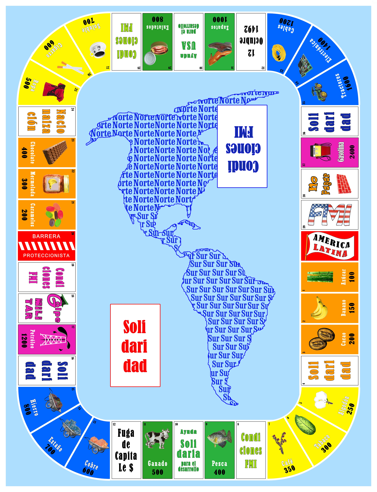

# 🎲 La Deuda Eterna - Web Edition

Versión digital e interactiva del clásico juego de tablero latinoamericano **La Deuda Eterna**, desarrollada en **Node.js, Express y Socket.io** con una interfaz con estética *glassmorphism*.

## 🚀 Características Principales

* **Sistema Multisala (Rooms):** Creación y unión a salas privadas mediante códigos únicos (ej. `LOBBY1`, `SALA2`).
* **Lobby y Control de Anfitrión:** Sala de espera con capacidad para **hasta 4 jugadores** por partida, donde únicamente el anfitrión puede dar inicio a la sesión.
* **Multijugador en Tiempo Real:** Partidas sincronizadas al instante mediante WebSockets (`Socket.io`).
* **Sesión Persistente y Reconexión:** Manejo de `userId` único para recuperar el estado ante caídas de red o cierres del navegador.
* **Salida Dinámica:** Función para abandonar la sala con liberación automática de propiedades e industrias al mercado para continuar la partida con fluidez.
* **Reglas Oficiales 100% Integradas:**
  * Capital inicial aleatorio según dados.
  * Gestión de Deuda Personal e Intereses del FMI (embargo a los $30,000 de deuda).
  * Mazo completo de tarjetas de **Solidaridad** y **Condiciones FMI**.
  * Construcción de **Industrias Nacionales** (Sur) y expansión a **Multinacionales** (Norte).
  * Unificación de la **Alianza Latinoamericana**.
  * Mecánicas especiales de embargo, subastas al 50%, expropiaciones y uso de lingotes de oro.

## 🛠️ Tecnologías Utilizadas

* **Backend:** Node.js, Express, Socket.io
* **Frontend:** HTML5, CSS3 (Glassmorphism), JavaScript Vanilla
* **Despliegue:** Render / GitHub

## 🌐 Jugar en Vivo

Puedes acceder a la versión desplegada en el siguiente enlace:
👉 [https://la-deuda-eterna.onrender.com](https://la-deuda-eterna.onrender.com)